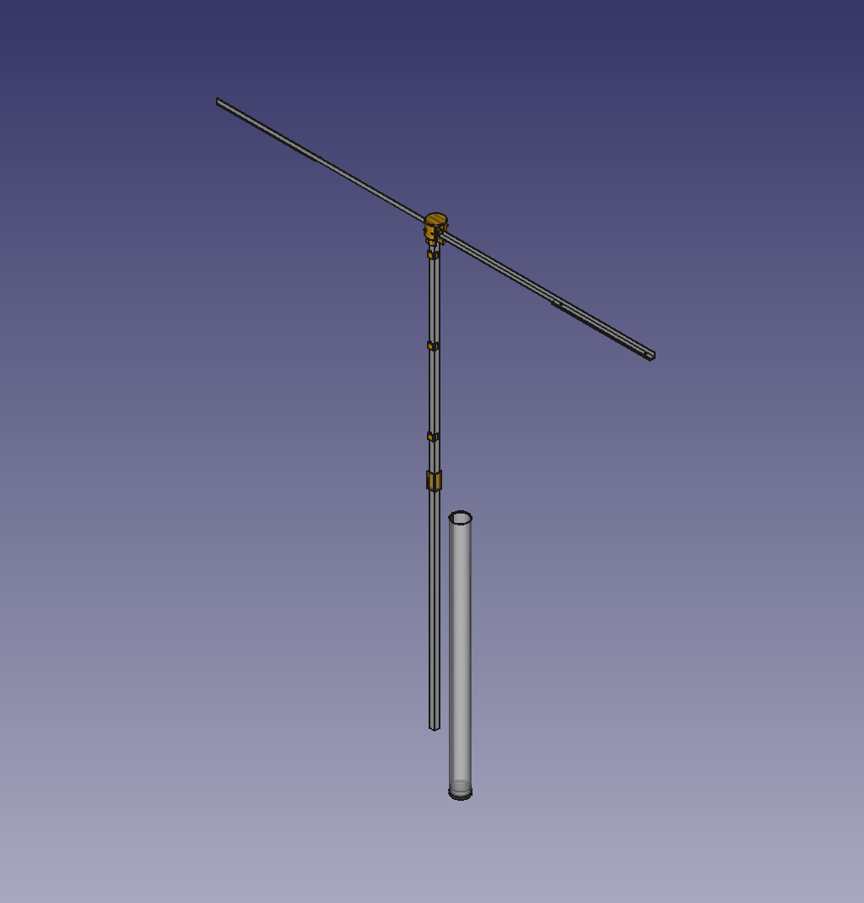
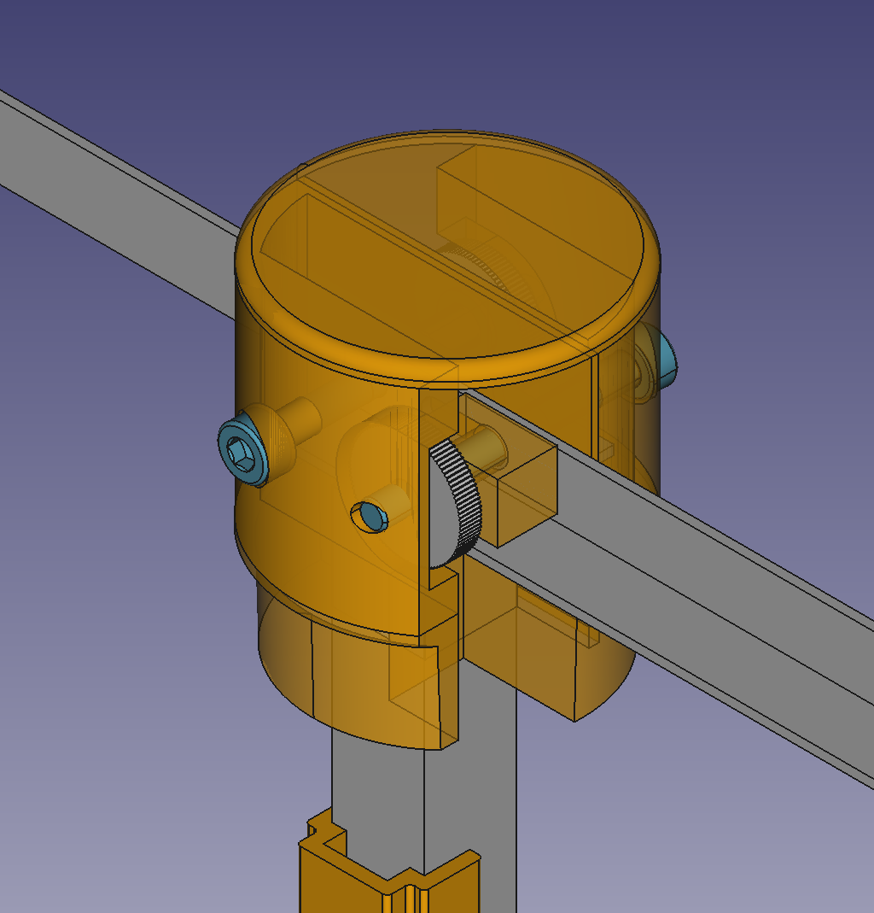
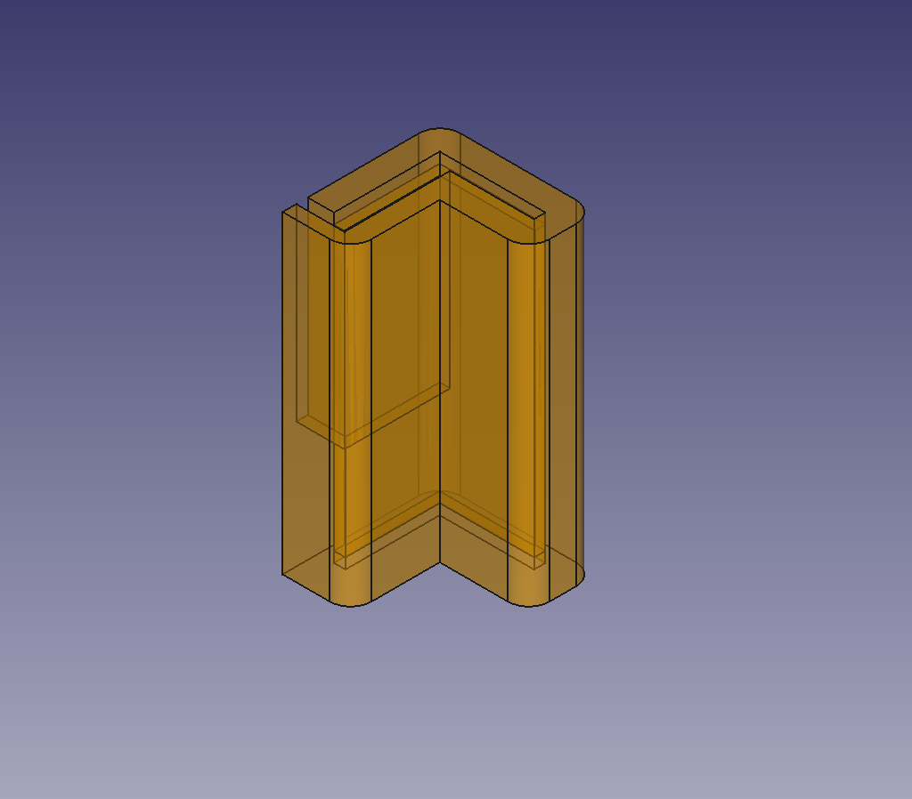
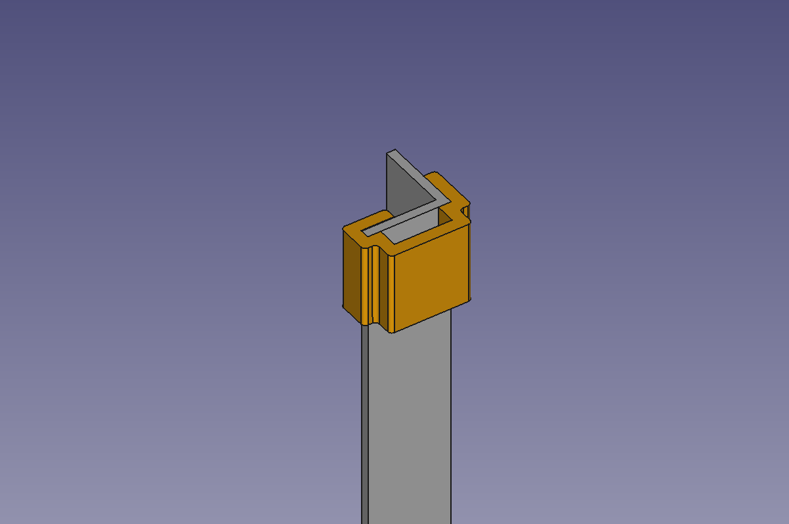
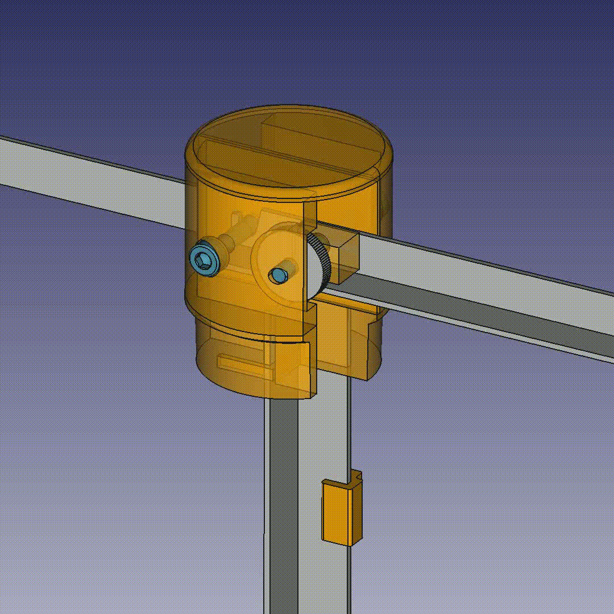
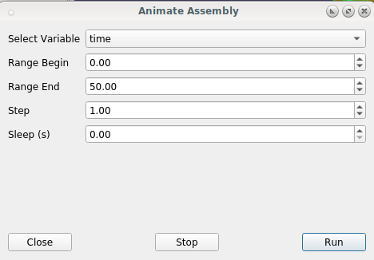

# Folding AngleBarLamp

This is a folding lamp made out of 3d-printed parts and angle-bars. The design was inspired by the lamps from [kliments workshoptoolset](https://github.com/kliment/workshoptoolset)

The lamp parts were designed using [Freecad 0.21.1](https://www.freecad.org/) and the [assembly4 workbench v0.50.6](https://github.com/Zolko-123/FreeCAD_Assembly4).

## Printed parts

### TopBlock

### BottomBlock

### CableClips

## Other parts

### Screws:
##### topBlock
  * 2x M3x28
      
##### COB LED attachment
  * 4x M3x4

### Angle bars for arms and foot (length can be modified to suit needs):
  * 2x  8mm x 400mm
  * 2x 10mm x 400mm

### Housing
  * 480mm of DN32 HT pipe 

### Electronics:
  * 2x COP LEDs that suite your needs
  * Power supply
  * Switch or dimmer (check workshoptoolset)
  * 2x 1.5m wire

## Folding Mechanism

### Running the animation in FreeCAD

* Open the assembly4 workbench
* Run "Animate Assembly" with these parameters

### Background

This assembly is a top-down design (using a minimal master sketch).

Parts are attached using the master sketch for the axes of the rotating parts as well as LCSs of adjacent parts.

Animation is controlled by the **time** variable. Nested conditional statements execute the different parts of the motion as the **time** variable is incremented. This way rotation and position parameters of the arms are calculated in the attachment section of moving parts. To keep the expression managable some intermediate variables are calculated in **Assembly/Variables**.

Some base dimensional parameters are kept in the **Spreadsheet** and can be modified via the spreadsheet workbench.
