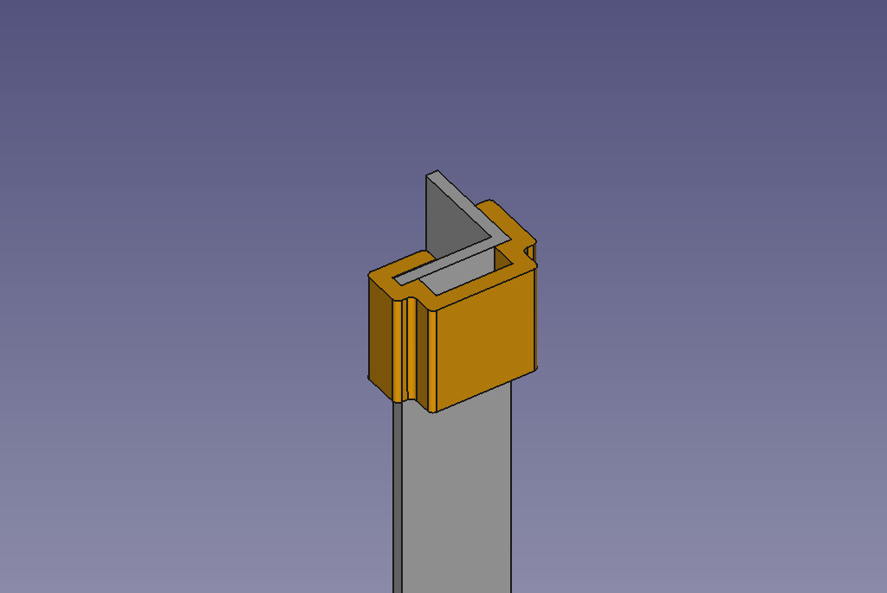
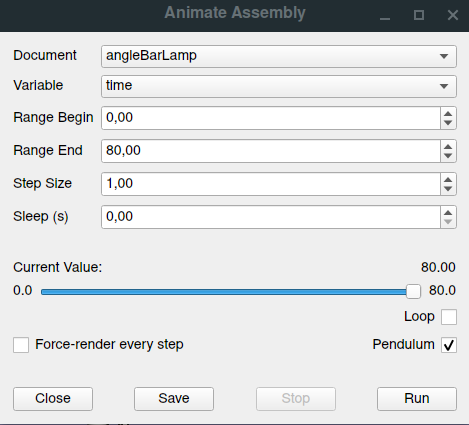

# Folding AngleBarLamp

Folding lamp made out of 3d-printed parts and anglebars. Inspired by the lamps from [kliments workshoptoolset](https://github.com/kliment/workshoptoolset)

The lamp parts where designed using Freecad 0.19 and the [assembly4 workbench](https://github.com/Zolko-123/FreeCAD_Assembly4).

## Printed parts

### TopBlock

### BottomBlock

### CableClips

## Other parts

### Screws:
##### topBlock
  * 2x M3x16
  
  or
   
  * 2x M3x18 + 2x M3 Washers & 2x M3 Nuts
      
##### COB LED attachment
  * 4x M3x10

### angle bars for arms and foot (length can be modified to suit needs):
  * 2x  8mm x 400mm
  * 2x 10mm x 400mm

### Electronics:
  * 2x COP LEDs that suite your needs
  * Power supply
  * Switch or dimmer (check workshoptoolset)
  * 2x 1.5m wire
## Folding Mechanism

### Running the animation in FreeCAD

* Open the assembly4 workbench
* Run "Animate Assembly" with these parameters

### Background

Animation parameters are in calculated in **Model/Variables** and the attachment section of the **LCS_screwhole** in **Parts/p_angleBar_8mm_arm** 
